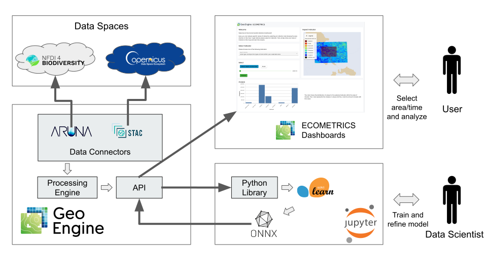
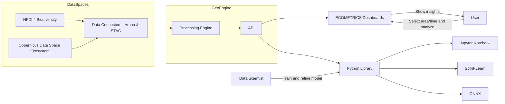

# FAIR-DS Demonstrator: Copernicus Data Space Machine Learning - ECOMETRICS

The ECOMETRICS app is a demonstrator for the FAIR-DS project.
This document presents the software architecture.
You can find more information about the app itself in the [FAIR-DS wiki](https://fair-ds4nfdi.github.io/wiki/).

## Architecture

There are four components to the ECOMETRICS app demonstrator: the Data Spaces, the Geo Engine instance, the machine learning in Jupyter and the ECOMETRICS dashboard.
There are two kinds of users: a Data Scientist that trains and refines a model and a user that select area and time of interest and performs an analysis.
The following diagram shows the architecture of the ECOMETRICS app. 

### Data Spaces

The demonstrator connects to the Copernicus Data Space and the NFDI4Biodiversity Data Space.
The NFDI4Biodiversity provides training labels for the machine learning model.
The Copernicus Data Space provides the satellite data.

### Geo Engine

Geo Engine has a data connector for each of the Data Spaces.
The connectors are able to browser metadata and access the raw data for analysis.
They map the files to the Geo Engine data model that supports temporal and spatial queries.
The processing engine harmonizes and enriches the data and makes it ready for machine learning.
Standardized and custom API methods make the data available.

#### Aruna Data Connector

The Aruna data connector implements the Geo Engine data provider interface.
It uses the Aruna RPC API to browse, find, and access data from the NFDI4Biodiversity data space using the Aruna data storage system.
By performing the translation between the Aruna API and the Geo Engine API, the connector allows to use data from the NFDI4Biodiversity data space in the Geo Engine platform.
This makes it possible to integrate the data easily into new analyses and dashboards.

#### Copernicus Data Space Ecosystem Data Connector

The Copernicus Data Space Ecosystem data connector implements the Geo Engine data provider interface.
It uses the STAC API to browse, find, and access data from the Copernicus Data Space Ecosystem.
It loads the satellite data using S3 and makes it available in the Geo Engine platform.

### Machine Learning in Jupyter

The machine learning notebook access the Geo Engine API to retrieve the data.
It uses Sci-kit Learn to train and refine a model.
The model is stored in the ONNX format and uploaded to the Geo Engine where it is registered and can be used as an operator.

### ECOMETRICS Dashboard

The ECOMETRICS Dashboard is an easy-to-use web app that build upon the Geo Engine UI toolkit.
The dashboard has an interactive map and lets the user select an area and time of interest.
It has an analysis functionality that triggers the Geo Engine to run the machine learning model.
